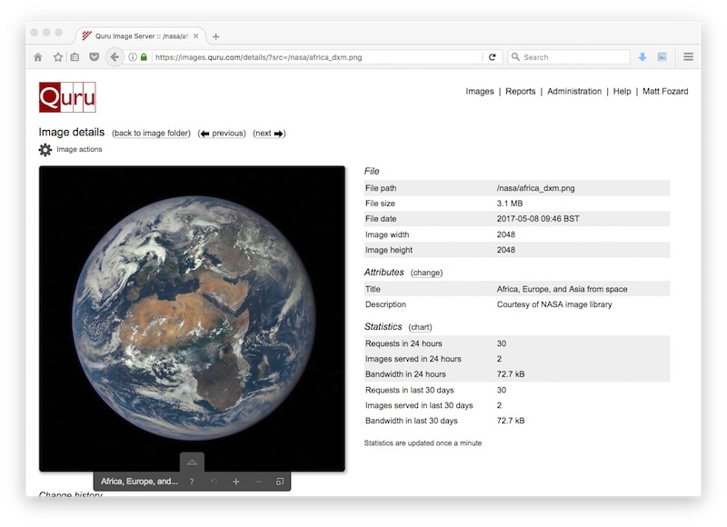
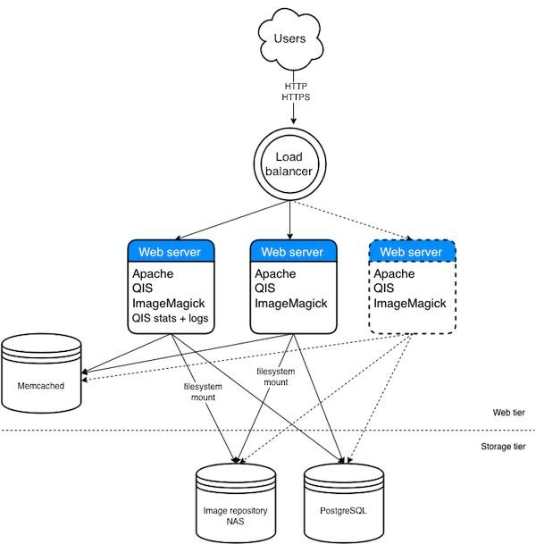

# Quru Image Server - dynamic imaging for web and print

QIS is a high performance web server for creating and delivering dynamic images.
It is ideal for use in conjunction with your existing web site, for applications
such as image galleries and product catalogues.

Quru has been using QIS in production since 2012, and the majority of source code
is made available here under the
[Affero GPL license](https://www.gnu.org/licenses/why-affero-gpl.en.html).

**Please note that at present, one of the required runtime packages -
`qismagick` - is not open source, and must be requested from Quru Ltd.**
This is due to some licencing restrictions which we are working on resolving.
To request a copy, please send an email to info@quru.com

Quru also offers commercial support for the image server.

## An example - HTML5 responsive images

With QIS it is a breeze to serve HTML5 [responsive images](https://responsiveimages.org/)
without having to manually resize or store multiple copies of the same image.

First we upload a single high resolution image `africa_dxm.png`.  
With different URLs we can then request scaled and cropped versions of the original:

and with a snippet of HTML we can ask the web browser to download whichever
*one* of these is most appropriate for the screen size for the device (desktop,
tablet, or phone):

	

	
	

You might notice we have also converted the image from `png` to `jpg` format,
to achieve smaller file sizes. These scaled images are automatically created
on-demand, and are then stored in a memory cache so that they are instantly
available next time around. The original image file is stored in a directory
on the server and is never modified.

## Features

Dynamic image operations include:

* Resize, rotate, flip, and crop
* Conversion to different image formats
* Blur and sharpen
* Overlays (for adding watermarks)
* Colorspace conversion
* ICC / ICM colour profiles (for print publishing)
* Stripping of image metdata to minimise image file sizes
* PDF to image conversion

See the [imaging user's guide](doc/image_help.md) for a full list.

Image presentation features include:

* Bookmarkable image URLs
* Image thumbnail generation
* HTML/JavaScript libraries
  * Dependency-free with support for Internet Explorer 9 and newer
  * Animated image zooming for HTML5-compliant web browsers and tablets
  * Full-screen image viewing
  * Image carousel / slideshow
  * Image gallery / folder viewer
  * Lazily-loaded images
* Image publishing wizard
* Access control via user-groups and folders

Programmatic features include:

* Image generation templates (a defined group of image operations)
* A REST API that allows you to securely upload images, generate dynamic images,
  and perform management and administration

See the [API user's guide](doc/api_help.md) for more detail.

Management features in the web interface include:

* File system and image browser
  * Add, rename, move, and delete image files and folders
* User and group administration
* Access control / user permissions administration
* System reports
  * Most popular images (by number of requests, bandwidth, processing time)
  * Server performance charts

## Screenshots

JavaScript library - image gallery (incorporating zooming viewer)  

Web interface - folder browse - list view  

Web interface - folder browse - grid view  

Web interface - image details  

Web interface - image publisher  

## Architecture

QIS depends on the following open source tools and applications:

* Linux operating system
* Python 3.4 or above - to run the QIS application code
* Apache 2.4 - the web server
* mod_wsgi Apache module - to run the QIS Python application inside Apache
* ImageMagick - to provide the image processing capabilities
* Memcached - for caching generated images and frequently accessed data
* PostgreSQL 9.2 or above - to store image and folder data, users, groups,
  statistics and permissions

For how these should be installed and configured,
see the [install guide](doc/install.md) and the [tuning guide](doc/tuning.md).

For low or predictable loads, you can install all of these on one server.
A single server installation will easily serve 5 million images per day
(60 per second), based on an 8 core CPU, 32GB RAM with a 20GB Memcached
instance, mostly scaling and cropping digital camera photographs,
and with 95% of requests served from cache.

For high or variable loads, you will want to separate the system into web and
storage tiers. Web servers scale better as multiple small servers (rather than
one large server), and image processing is typically CPU intensive, therefore it
is primarily the web tier that should be scaled out. As an example:

This system can be scaled up and down on-demand (elastic scaling) by adding or
removing web servers at any time. Memcached can run either on a separate server
if the network is fast, on one "master" web server, or configured as a cluster
across all the permanent web servers. QIS enables
[consistent hashing](https://en.wikipedia.org/wiki/Consistent_hashing) when
using a Memcached cluster, but you should avoid adding/removing servers to/from
the cluster because of the re-distribution of keys that will occur.

The storage tier is harder to scale. Although in general QIS does not use the
PostgreSQL database heavily, storing the Postgres data files on a fast disk
or SSD is advantageous. The v9.x releases of Postgres have seen some significant
performance improvements, so always use the latest version available.
PostgreSQL though, can also be clustered and replicated.

## Developing, building and running

To run QIS in a development environment, you will need either local or remote
Memcached and PostgreSQL servers, ImageMagick installed locally, Python 3.4 or
above, and Python development tools `pip`, `wheel`, and `virtualenv`.
Development is possible on Linux or on Mac OS X.

### Operating system packages

See the [install guide](doc/install.md) for the required system package
repositories and packages.

The following development packages (here on a Fedora-based system) are also
required in order to build and install the Python libraries:

	$ sudo yum install -y gcc gcc-c++ git curl wget make tar zip unzip which \
	                   postgresql-devel openldap-devel openssl-devel libmemcached-devel \
	                   python35u-devel python35u-pip python35u-setuptools
	$ sudo pip3.5 install --upgrade pip setuptools
	$ sudo pip3.5 install virtualenv

### Starting development

Get the code, create a virtualenv and install the Python dependencies:

	$ git clone https://github.com/quru/qis.git
	$ cd qis
	$ make venv

You will need to [request a copy of the `qismagick` package](#qismagick.so)
for your development platform, and install it:

	$ . bin/activate
	$ pip install qismagick-3.0.0-cp35-cp35m-linux_x86_64.whl

Create 2 empty Postgres databases, `qis-cache` and `qis-mgmt`.
Create a `local_settings.py` file in the `conf` folder, and add settings:

* `DEBUG` to `True`
* `MEMCACHED_SERVERS`, `CACHE_DATABASE_CONNECTION`, and `MGMT_DATABASE_CONNECTION`
* `INSTALL_DIR` to be the path of your project root
* Repeat all the `*_BASE_DIR` values, to apply the new value of `INSTALL_DIR`

To see the default values and other settings you can override, see the
[default settings file](src/imageserver/conf/base_settings.py).

Then run the server in development mode with:

	$ make runserver
	...
	[checks/installs Python libraries]
	...
	2017-03-06 16:11:39,932 qis_37720  INFO     Quru Image Server v3.0.0 engine startup
	2017-03-06 16:11:39,934 qis_37720  INFO     Using settings base_settings + local_settings.py
	...
	 * Running on http://127.0.0.1:5000/ (Press CTRL+C to quit)

On first run, the required database tables and default data will be created
automatically. Watch the output for the creation of the `admin` user account,
and make a note of the password. If you didn't enable `DEBUG` mode, look for it
in `logs/qis.log` instead.

While `DEBUG` is `True`, the un-minified versions of JavaScript files are served
up, and you can make JavaScript changes and refresh your browser to bring them in.
When your changes are complete, to minify the JavaScript files for deployment and
when `DEBUG` is `False`, run:

	$ make webpack

To run QIS in production, you will need files:

* `Quru Image Server-3.xx.tar.gz` - the main QIS Python web application
* `QIS-libs.tar.gz` - the application's Python dependencies,
  including compiled C extensions as platform-specific binaries
* and unless your `QIS-libs.tar.gz` was supplied by Quru, you will also need
  to [request a copy of the `qismagick` package](#qismagick.so) for your
  production platform

To generate these files from the development project, run:

	$ make distribute
	...
	[build script output]
	...
	$ ls -l dist/
	-rw-r--r--  1 matt  staff   5798089  5 Feb 10:19 QIS-libs.tar.gz
	-rw-r--r--  1 matt  staff  54698387  5 Feb 10:19 Quru Image Server-3.0.0.tar.gz

With these files prepared you should then follow the [install guide](doc/install.md).

### Running in Docker

For a much simpler deployment, QIS can be deployed on Docker. There is a `docker-compose`
script that will set up and run almost everything for you. The only extra setup required
is a volume on the host in which to store the persistent data, and a couple of
environment variables.

See the [docker-compose](deploy/docker/docker-compose.yml) script and the
[application server image notes](deploy/docker/qis-as/README.md) for more information.

## Version 2

QIS version 2 brought these new features in 2017:

* Image templates are now stored in the database and managed from the web
  interface inside QIS
* Default image values (format, compression, EXIF stripping, etc) are now
  defined in a default image template, and can be changed from the web
  interface inside QIS
* Any image parameter can now have a default value (in the default template)
* Simpler override rules for image parameters
* REST API improvements, including programmatic template management
* Improvements to SVG file support
* Built-in support for RAW digital camera image formats
* Faster image serving for logged-in users (and authenticated API callers)
* Bug fixes to the image publisher
* Web interface improvements
  * New grid / thumbnail browse view
  * New icons and a more consistent page layout
  * New next/previous image navigation
  * The order of files and folders in the web interface is no longer case sensitive
* A new JavaScript library for lazily loading images (new in v2.5)
  * See Quru's [image-defer library](https://github.com/quru/image-defer)
* Removed the requirement to use the MooTools library on the client side (new in v2.6)
* Image portfolios (new in v2.7)
  * The creation of a virtual folder of selected images
  * A friendly URL to view the images
  * Download all as a zip file
  * Private, restricted, or public access levels
  * API support currently, user interface support to come in a future release
  * See also [the portfolios specification](./doc/v2/Portfolios.md)

## Version 3

QIS v3 is a port of QIS v2.7 to run on Python 3 only. It contains a few tidy-ups,
slightly better performance thanks to Python 3 improvements, but otherwise no
new features.

Migrating to v3 is essentially a case of installing new packages and re-installing
the application, but for more information see the [upgrading guide](./doc/upgrading.md).

## Roadmap

Under consideration for future versions:

* Image portfolios user interface
  * Addition of "add to basket" while image browsing in the admin interface
  * Addition of portfolios administration to the admin interface
  * Portfolio publishing (to zip) from the admin interface
  * Viewing a portfolio from the gallery and slideshow viewers
* Improve the image generation architecture for more consistent performance under load
* Optional long image URL to tiny URL conversion
  * New checkbox in the image publisher
  * Add to REST API
  * Tiny URL admin pages in the web interface
* Prevent certain image attributes (width, height, overlay) from being overridden
* Image search and search results
* Image tags
  * System-defined e.g. assignment of an image category
  * User-defined
  * Tagging a zone or location on an image
  * Searching by tag
* Modernise the public JavaScript APIs / viewers
  * Use HTML5 `data-` attributes for automatic initialisation
  * Reduce the number of included files
* The ability to use an object store (e.g. Amazon S3) for back-end image storage
* New imaging operations
  * Automatic crop to target dimensions
  * Generate image frames from video files (like Gifify)
  * Enhanced EXIF / XMP support e.g. to set copyright text
  * Automatic file size optimisation (like PNG Crush)
* Support for new image formats
  * BPG, JPEG XR, WEBP
  * Wide colour / Display P3 profiles
* Cloud storage integration (Dropbox, Google Drive, ...)
* Social media integration (Instagram, Flickr, Pinterest, ...)
